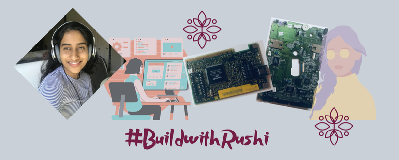

# Build with Rushi

Hello! welcome to the #[buildwithrushi](rushiblogs.weebly.com/buildwithrushi) series!! This is just a fun little series of building cool things with micro-controllers & computers!! 

This series has now concluded, with 7 fun and detailed episodes shown below!

Check out [link](rushiblogs.weebly.com/buildwithrushi) for more info and tutorials! Thank you!

**Episodes**
1. Digital to Analog Convertor: Click [here](https://youtu.be/2ppTv4JvILo)
2. Simple Count Down Timer: Click [here](https://youtu.be/1Ulmq-eM7rE)
3. Light Detection System: Click [here](https://youtu.be/LLheGk_87gE)
4. Slap Jack C++ Simulation: Click [here](https://youtu.be/T-2g_XD7mdE)
5. An SSH Server in your Home Computer: Click [here](http://rushiblogs.weebly.com/buildwithrushi.html)
6. Grade Calculator using a Quick Python Script: Click [here](https://youtu.be/C4OqY0o8pPo)
7. Deep Learning with Fashion MNIST: Click [here](https://rushiblogs.weebly.com/buildwithrushi)
